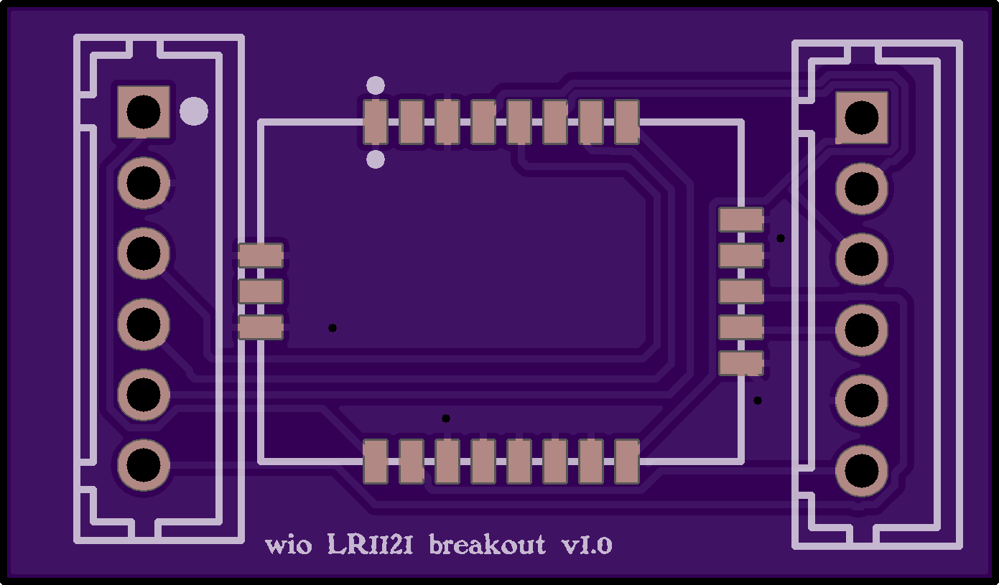
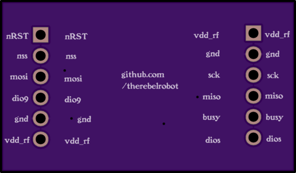
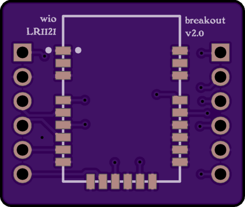
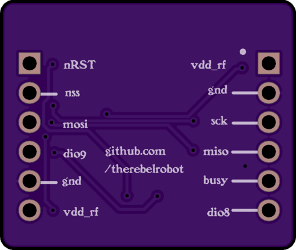

# circuitboards
Where I'm dumping all my Gerber files and wiring notes for all my boards

## Boards

| Board | Revision | Top | Bottom |
|:---|:---:|:---:|:---:|
| Wio LR1121 Breakout | [v1.0](wio_lr1121_breakout/v1.0/) |  |  |
| Wio LR1121 Breakout | [v2.0](wio_lr1121_breakout/v2.0/) |  |  |
| XIAO ANO Carrier Board | [v1.0](xiao_ano_carrier/v1.0/) |  |  |

## License

The hardware designs in this repository (schematics, PCB layouts, Gerber files, and related design files) are licensed under the [CERN Open Hardware Licence Version 2 — Permissive (CERN-OHL-P v2)](./LICENSE). This is the hardware equivalent of the MIT License: you're free to use, modify, manufacture, and distribute these designs with minimal restrictions. See the [LICENSE](./LICENSE) file for full terms.
