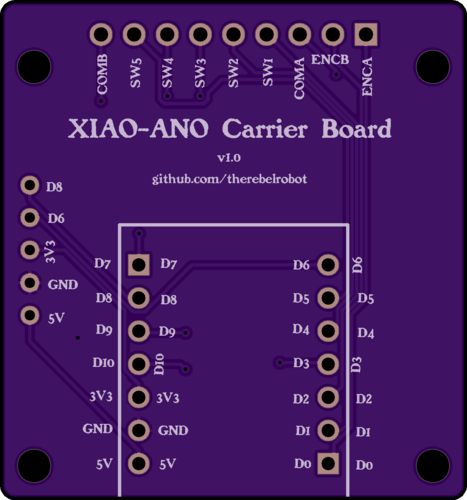
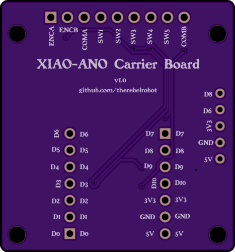
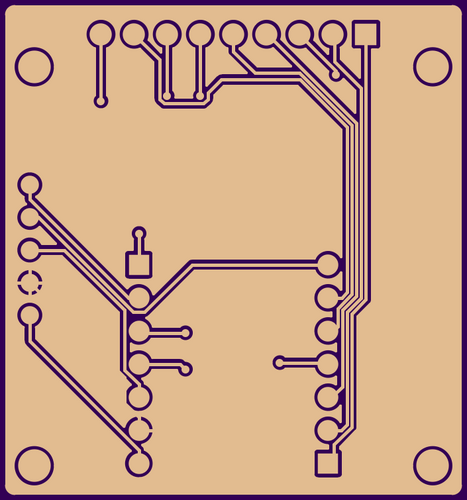
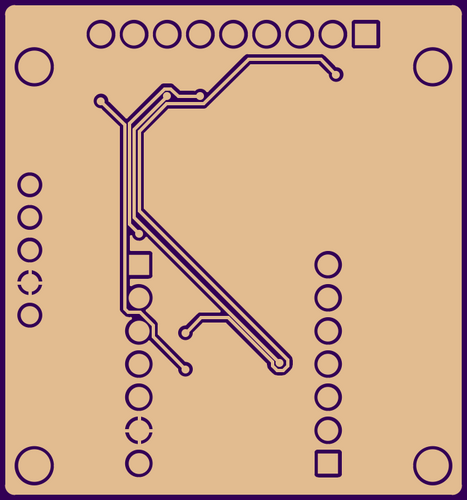
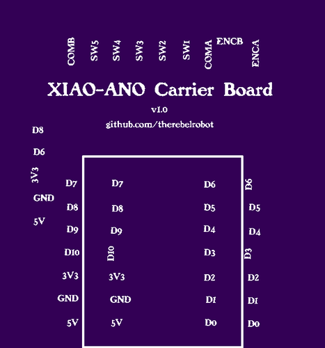
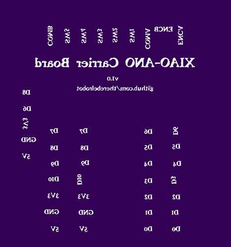
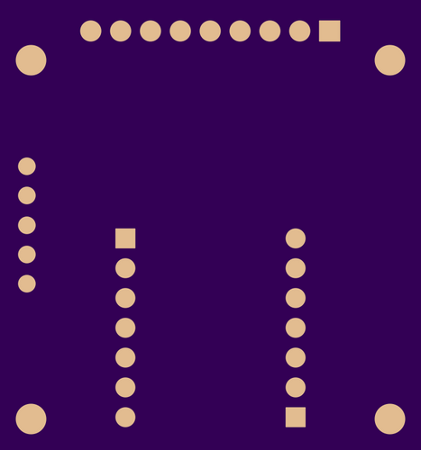
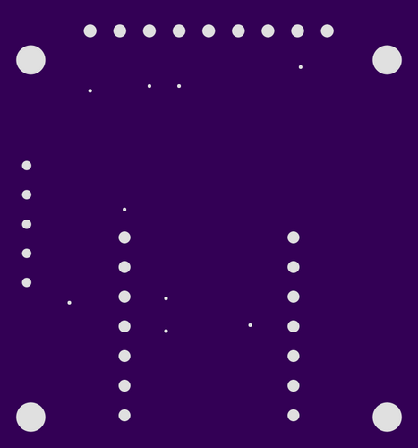
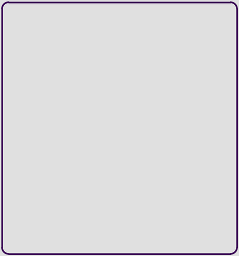

# XIAO ANO Carrier Board — v1.0

Manufacturing images for this board revision.

## Top

## Bottom

## Copper Layers

| Top Copper | Bottom Copper |
|:---:|:---:|
|  |  |

## Silkscreen Layers

| Top Silk | Bottom Silk |
|:---:|:---:|
|  |  |

## Solder Mask Layers

| Top Solder | Bottom Solder |
|:---:|:---:|
|  |  |

## Drills

## Board Outline

